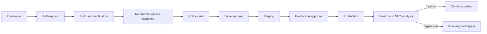

# Architecture

## Requirements

- Promote exactly one immutable artifact across environments.
- Reject missing evidence, mutable images, skipped stages, and unapproved production changes.
- Preserve enough history for deterministic rollback and incident reconstruction.
- Keep the learning path executable without credentials or infrastructure cost.

## Control flow

## Responsibility boundaries

| Component | Owns | Does not own |
|---|---|---|
| Application CI | tests, artifact identity, security evidence | environment mutation |
| Release policy | minimum evidence and promotion order | business approval decision |
| GitOps reconciler | desired-to-actual convergence | generating a new artifact |
| Progressive delivery | traffic steps and metric analysis | silently overriding policy |
| Observability | release-correlated signals | deciding acceptable business risk alone |

## High availability and scalability

Production controllers should run redundantly, use idempotent reconciliation, and recover desired state from Git. Build workers scale separately from reconcilers. Registry, Git provider, signing service, and metric backend failures need explicit retry budgets and degraded-operation procedures.

## Disaster recovery

Git preserves desired-state history; the registry preserves immutable artifacts and attestations; an external audit store preserves deployment events. Recovery exercises must prove that a new controller can reconstruct current state, verify the referenced digest, and deploy it without rebuilding.

## Trade-offs

Promotion speed is intentionally reduced by evidence and approval gates. That cost buys repeatability and auditability. Emergency access should be time-limited, logged, reviewed after use, and unable to replace immutable evidence.

